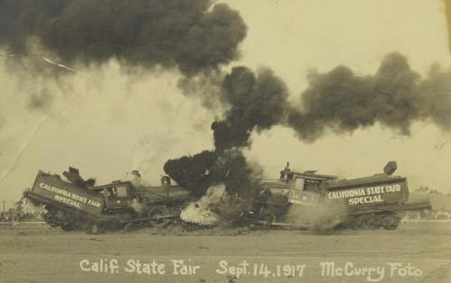

# Your Game Title

Use [Markdown](https://en.wikipedia.org/wiki/Markdown) to format your document. There is a [GitHub specific guide](https://guides.github.com/pdfs/markdown-cheatsheet-online.pdf) that you can download to your computer.

Create a new(-ish) traditional-style game that can be played with common household materials. Please exclude any designs that use alcohol, controlled substances, or can cause physical/emotional pain. Provide instructions on how to play your game and a list of materials needed to play your game. Please illustrate your instructions.

In the README.md you shall:
* give general overview of the game
* describe objectives and strategies
* provide the rules and an explanation of the rules
* illustrate the game, game pieces, application of the rules, etc.

In materials.md you shall list all the materials needed to make the game.

The directory named images should contain all the images you wish to use in the document. You can show images in a Markdown file very easily.

Use a digital camera or smart phone camera to show how to play your game.
