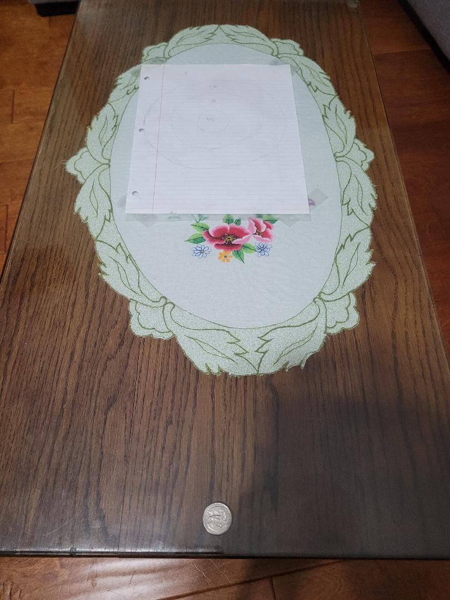

# Coin Dart

## General Overview:
This game is similar to playing darts. Instead of throwing darts, you will be flicking a quarter. The coin is your dart and the board will be a drawn target on a piece of paper. Wherever the coin lands will decide how many points you get. The game can have as many players as possible. It could be played solo, but it is more fun to compete with other people.

## Objectives
The objective of the game is to flick the coin and make it land on the target. The most ideal spot is in the middle of the paper. You win if you get the most points.

## Rules
The rule is you have to start at the indicated line and place your quarter flat on the surface. You flick the quarter into the paper. If the quarter lands on the line, then decide the tie by where the majority of the quarter is on. If you can't decide and think it's dead even, then flip the quarter to decide the score (for example, 10 points if head or 20 if tails). If you miss the paper, then you get 0 points. You can flick any way you like. The two most common ways is with index finger or with your thumb.

## Setting up the game
You need to draw on the piece of paper 3 circles with one within another. It should look like a target. Try to make the circles evenly spaced out. Label the points on the paper between the circle lines. The middle should be the highest points and it gets reduced as the circle gets farther away. 50 points in the middle, 25 points in the second area, then 10 after, and finally 5 outside the circle.
Use the edge of a table as the starting line. If you don't have a table, then you can use the floor and make a starting line. For example, you can use tape another piece of paper on the surface and use the edge as the starting line. Place the target paper at least 2 feet away from the starting line and tape it so that it is stuck flat onto the table. Note: The front edge of the paper should be completely taped down or else the coin might slide under the paper.
Game is all set and ready to play.

## How to play
Place the quarter in front of the starting line. You will use your index finger to flick the quarter. Try to get it on the paper. Wherever it lands, you will get that many points. Record your points and reset the quarter to the starting position. The next player will play and try to beat your score. Each play will alternate. After 3 rounds, the player with the highest score wins.

## Change it up
To make the game more challenging, you can:
* change the coin (to a penny)
* change the target (make it smaller)
* place the target farther away

## Images

